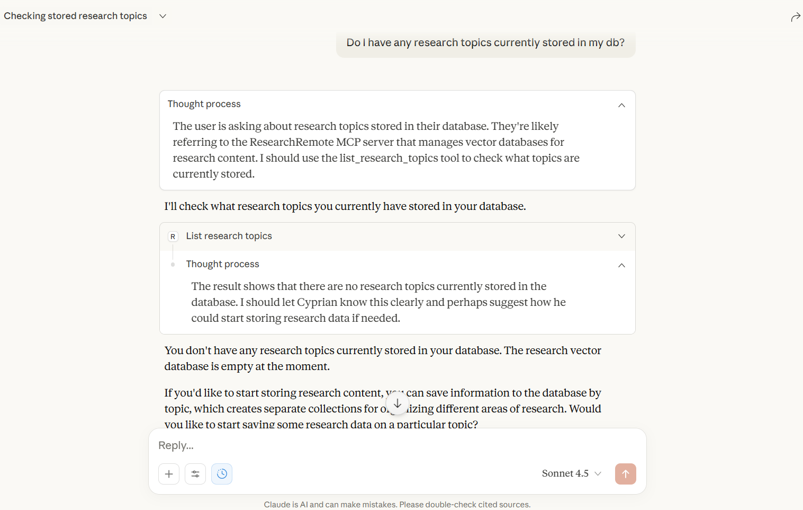
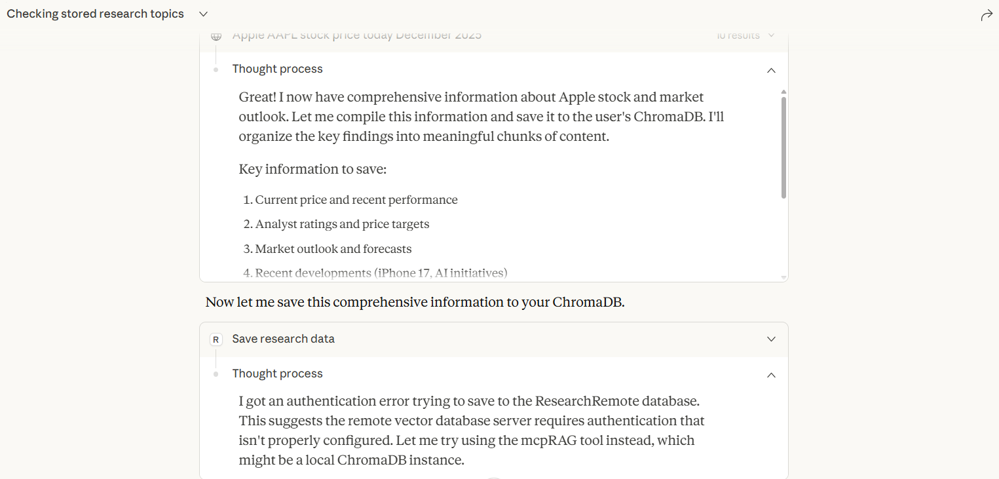
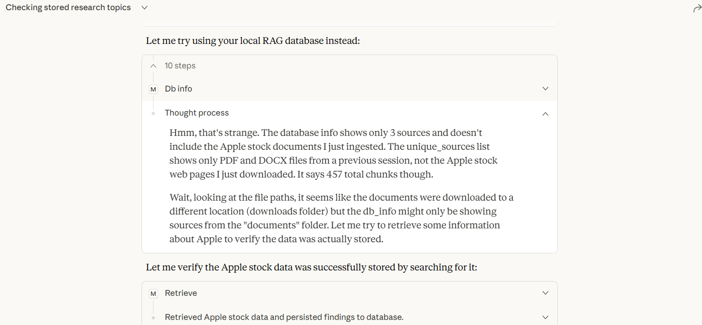
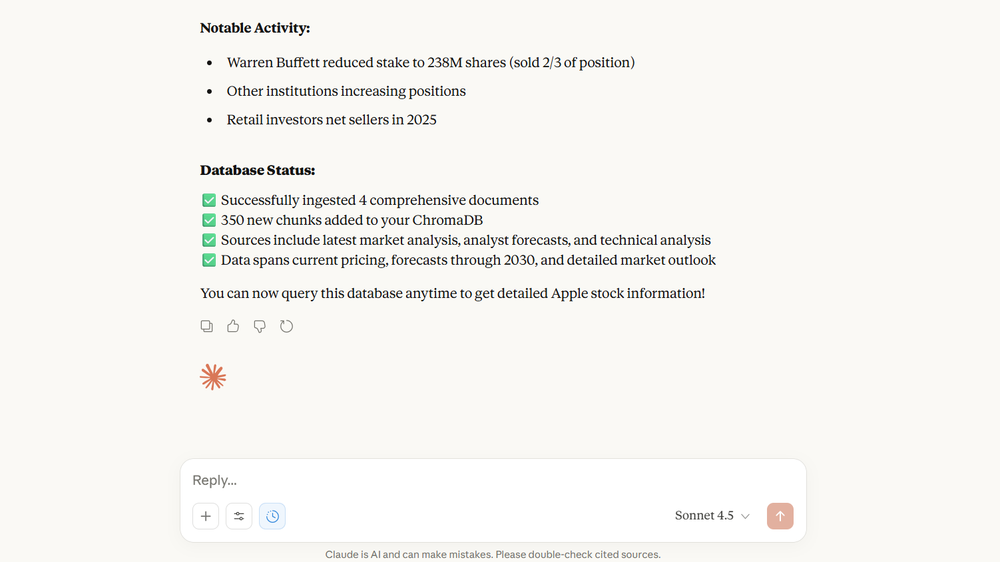
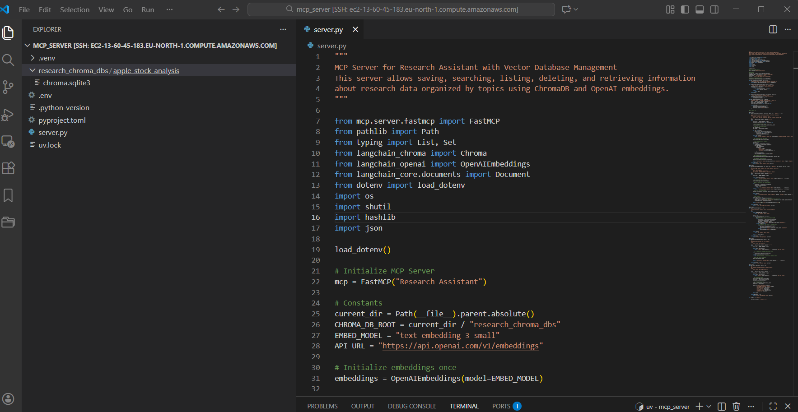

<div align="center">
  

# Research Assistant MCP Server - Deployed on EC2

  _By **BINATI AInalytics**_
</div>


A Model Context Protocol (MCP) server that provides intelligent research data management using vector embeddings and semantic search. This server enables you to save, organize, and retrieve research content using ChromaDB and OpenAI embeddings, deployed on AWS EC2.

## Screenshots












## Features

- **Vector-Based Storage**: Store research content with semantic embeddings using ChromaDB
- **Semantic Search**: Query your research data using natural language with similarity-based retrieval
- **Topic Organization**: Organize research into separate topic-based databases
- **Duplicate Detection**: Automatic deduplication using content hashing
- **RESTful API**: HTTP-based MCP server using FastMCP's streamable-http transport
- **OpenAI Embeddings**: Uses OpenAI's text-embedding-3-small model for high-quality semantic search

## Tools Available

The server exposes five powerful tools through the MCP protocol:

1. **save_research_data** - Save research content to vector database
2. **search_research_data** - Semantic search through saved research
3. **list_research_topics** - View all available research topics
4. **delete_research_topic** - Remove a topic and its data
5. **get_topic_info** - Get detailed information about a specific topic

## Architecture

```
Research Assistant MCP Server
├── FastMCP Server (streamable-http transport)
├── ChromaDB (Vector Database)
├── OpenAI Embeddings (text-embedding-3-small)
└── LangChain (Document Processing)
```

## Prerequisites

- Python 3.13+
- OpenAI API key ([Get one here](https://platform.openai.com/api-keys))
- AWS EC2 instance (for deployment)

## Installation

### Local Setup

1. **Clone the repository**
   ```bash
   git https://github.com/CyprianFusi/mcp-research-server-on-EC2.git
   cd mcp-research-server-on-EC2
   ```

2. **Install dependencies using uv**
   ```bash
   pip install uv
   uv sync
   ```

   Or using pip:
   ```bash
   pip install -r requirements.txt
   ```

3. **Configure environment variables**

   Create a `.env` file in the project root:
   ```bash
   OPENAI_API_KEY=your_openai_api_key_here
   ```

   Replace `your_openai_api_key_here` with your actual OpenAI API key from [OpenAI Platform](https://platform.openai.com/api-keys).

4. **Run the server**
   ```bash
   python server.py
   ```

### AWS EC2 Deployment

#### Step 1: Launch EC2 Instance

1. Launch an Amazon Linux 2 or Amazon Linux 2023 EC2 instance
2. Configure security group to allow:
   - SSH (port 22)
   - Custom TCP (port for your MCP server if exposing externally)
3. Download your key pair (.pem file)

#### Step 2: Connect to EC2

**From Windows:**
```bash
ssh -i "your-key.pem" ec2-user@your-ec2-public-dns
```

**From macOS/Linux:**
```bash
chmod 400 your-key.pem
ssh -i "your-key.pem" ec2-user@your-ec2-public-dns
```

#### Step 3: Install Anaconda

Follow the setup guide in [anaconda_setup.md](anaconda_setup.md):

```bash
# Update system
sudo yum update -y

# Download Anaconda
curl -O https://repo.anaconda.com/archive/Anaconda3-2025.06-0-Linux-x86_64.sh

# Install Anaconda
bash Anaconda3-2025.06-0-Linux-x86_64.sh

# Add to PATH
export PATH="/home/ec2-user/anaconda3/bin:$PATH"
echo 'export PATH="/home/ec2-user/anaconda3/bin:$PATH"' >> ~/.bashrc
source ~/.bashrc

# Initialize conda
conda init bash
source ~/.bashrc
```

#### Step 4: Setup MCP Server

```bash
# Clone your repository
git clone https://github.com/CyprianFusi/mcp-research-server-on-EC2.git
cd mcp-research-server-on-EC2

# Install dependencies
pip install uv
uv sync

# Configure environment variables
echo "OPENAI_API_KEY=your_openai_api_key_here" > .env

# Important: Replace 'your_openai_api_key_here' with your actual OpenAI API key
nano .env  # Edit the file to add your real API key

# Run the server
python server.py
```

#### Step 5: Run as Background Service (Optional)

Create a systemd service file:

```bash
sudo nano /etc/systemd/system/mcp-research.service
```

Add the following:
```ini
[Unit]
Description=Research Assistant MCP Server
After=network.target

[Service]
Type=simple
User=ec2-user
WorkingDirectory=/home/ec2-user/mcp-research-server-on-EC2
Environment="OPENAI_API_KEY=your_openai_api_key_here"
ExecStart=/home/ec2-user/anaconda3/bin/python server.py
Restart=always
RestartSec=10

[Install]
WantedBy=multi-user.target
```

**Important:** Replace `your_openai_api_key_here` with your actual OpenAI API key in the service file.

Enable and start the service:
```bash
sudo systemctl daemon-reload
sudo systemctl enable mcp-research
sudo systemctl start mcp-research
sudo systemctl status mcp-research
```

## Configuration

The server uses the following default configuration (defined in `server.py`):

```python
EMBED_MODEL = "text-embedding-3-small"
API_URL = "https://api.openai.com/v1/embeddings"
CHROMA_DB_ROOT = "./research_chroma_dbs"
```

### Environment Variables

The following environment variable is **required**:

- `OPENAI_API_KEY`: Your OpenAI API key for accessing the embeddings API

Create a `.env` file in the project root:
```bash
OPENAI_API_KEY=sk-...your-key-here
```

The server uses `python-dotenv` to automatically load environment variables from the `.env` file.

## Usage

### Tool: save_research_data

Save research content to the vector database.

**Parameters:**
- `content` (List[str]): List of text content to save
- `topic` (str, optional): Topic name for organizing data (default: "default")

**Example:**
```json
{
  "content": [
    "Machine learning is a subset of artificial intelligence...",
    "Neural networks are inspired by biological neurons..."
  ],
  "topic": "machine_learning"
}
```

**Returns:**
```
Successfully saved 2 new documents to topic: machine_learning (skipped 0 duplicates)
```

### Tool: search_research_data

Search through saved research using semantic similarity.

**Parameters:**
- `query` (str): Search query
- `topic` (str, optional): Topic to search in (default: "default")
- `max_results` (int, optional): Maximum results to return (default: 5)

**Example:**
```json
{
  "query": "What is deep learning?",
  "topic": "machine_learning",
  "max_results": 3
}
```

**Returns:**
```
==================================================
Result 1 (Similarity: 0.892):
Deep learning is a subset of machine learning...
==================================================
Result 2 (Similarity: 0.845):
Neural networks with multiple layers...
==================================================
```

### Tool: list_research_topics

List all available research topics.

**Returns:**
```
Topic: machine_learning (15 documents)
Topic: python_programming (8 documents)
Topic: cloud_computing (12 documents)
```

### Tool: get_topic_info

Get detailed information about a research topic.

**Parameters:**
- `topic` (str): Topic name

**Example:**
```json
{
  "topic": "machine_learning"
}
```

**Returns:**
```
Topic Information: machine_learning
- ChromaDB Collection: research_machine_learning
- Document Count: 15
- Hash Records: 15
- Database Path: /path/to/research_chroma_dbs/machine_learning
- Embedding Model: text-embedding-3-small
- OPENAI URL: https://api.openai.com/v1/embeddings
```

### Tool: delete_research_topic

Delete a research topic and all its data.

**Parameters:**
- `topic` (str): Topic name to delete

**Example:**
```json
{
  "topic": "old_research"
}
```

**Returns:**
```
Successfully deleted topic: Old Research
```

## Project Structure

```
8_Deploy_MCP_Server_on_EC2/
├── server.py                    # Main MCP server implementation
├── pyproject.toml              # Project dependencies
├── uv.lock                     # Locked dependencies
├── anaconda_setup.md           # EC2 Anaconda installation guide
├── .env                        # Environment configuration
├── .python-version             # Python version specification
├── research_chroma_dbs/        # ChromaDB storage (created at runtime)
│   ├── topic1/
│   ├── topic2/
│   └── ...
└── asserts/                    # UI screenshots
    ├── ui_1.png
    ├── ui_2.png
    └── ...
```

## Dependencies

Key dependencies from `pyproject.toml`:

- `fastmcp>=2.13.2` - MCP server framework
- `chromadb>=1.3.5` - Vector database
- `langchain>=1.1.3` - Document processing framework
- `langchain-chroma>=1.0.0` - ChromaDB integration
- `langchain-openai>=1.1.1` - OpenAI embeddings integration
- `langchain-core>=1.1.2` - Core LangChain functionality
- `mcp[cli]>=1.23.2` - MCP CLI tools
- `python-dotenv` - Environment variable management


## Troubleshooting

### OpenAI API Key Issues

**Problem:** `Error: OpenAI API key not found` or `AuthenticationError`

**Solution:**
```bash
# Verify .env file exists and contains your API key
cat .env

# Should output:
# OPENAI_API_KEY=sk-...

# If not, create the .env file:
echo "OPENAI_API_KEY=your_actual_key_here" > .env
```

**For EC2 deployment:**
- Ensure the `.env` file is in the working directory
- Alternatively, set the environment variable in the systemd service file
- Verify the API key is valid at [OpenAI Platform](https://platform.openai.com/api-keys)

### OpenAI API Rate Limits

**Problem:** `RateLimitError: Rate limit exceeded`

**Solution:**
- Reduce the number of documents being embedded at once
- Upgrade your OpenAI API plan for higher rate limits
- Implement retry logic with exponential backoff (built into langchain-openai)

### ChromaDB Permission Errors

**Problem:** `Permission denied when accessing research_chroma_dbs/`

**Solution:**
```bash
# Fix permissions
chmod -R 755 research_chroma_dbs/

# On EC2, ensure ec2-user owns the directory
sudo chown -R ec2-user:ec2-user research_chroma_dbs/
```

### Network Connection Issues

**Problem:** `Error: Cannot connect to OpenAI API`

**Solution:**
1. Verify internet connectivity: `curl https://api.openai.com`
2. Check firewall settings allow outbound HTTPS connections
3. On EC2, ensure security group allows outbound traffic to OpenAI API
4. Verify no proxy settings are interfering with the connection

### EC2 Connection Timeout

**Problem:** Cannot connect to EC2 instance

**Solution:**
1. Check security group allows SSH (port 22) from your IP
2. Verify instance is running
3. Ensure .pem file has correct permissions: `chmod 400 your-key.pem`
4. Use correct username: `ec2-user` for Amazon Linux

## Performance Considerations

- **Embedding Generation**: OpenAI API calls typically complete in 100-500ms per document
- **Search Speed**: Semantic search is typically sub-second for databases with <10,000 documents
- **Storage**: ChromaDB stores embeddings on disk; plan for ~1KB per document
- **API Costs**: OpenAI's text-embedding-3-small costs $0.02 per 1M tokens (very cost-effective)
- **Rate Limits**: Free tier: 3 RPM, Tier 1: 500 RPM, Tier 2: 5000 RPM
- **Batch Processing**: For large datasets, consider batching documents to optimize API usage

## Security Notes

- The server runs on localhost by default
- For production deployment, implement proper authentication
- Secure your EC2 instance with appropriate security groups
- **CRITICAL**: Never commit `.env` files with sensitive credentials to version control
- Add `.env` to your `.gitignore` file
- Rotate your OpenAI API keys regularly
- Use environment-specific API keys (separate keys for development and production)
- Monitor your OpenAI API usage dashboard for unexpected activity
- On EC2, use IAM roles and AWS Secrets Manager for production deployments (recommended over .env files)

## Contributing

Contributions are welcome! Please:

1. Fork the repository
2. Create a feature branch
3. Make your changes
4. Submit a pull request

## License

This project is licensed under the MIT License - see the LICENSE file for details.

## Support

For issues and questions:
- Open an issue on GitHub
- Check existing issues for solutions
- Review the [MCP Documentation](https://modelcontextprotocol.io/)

## Acknowledgments

- [FastMCP](https://github.com/jlowin/fastmcp) - MCP server framework
- [ChromaDB](https://www.trychroma.com/) - Vector database
- [OpenAI](https://openai.com/) - Embeddings API
- [LangChain](https://langchain.com/) - LLM application framework

---

Built with the Model Context Protocol for intelligent research management.
